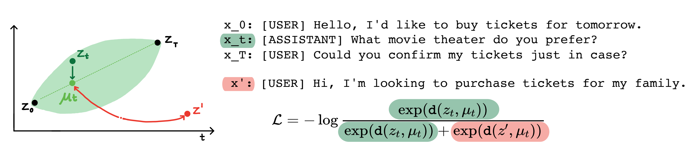
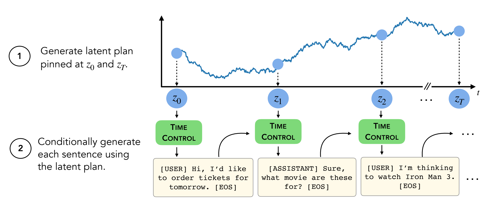

# Language modeling via stochastic processes
[[Paper]](https://arxiv.org/pdf/2203.11370.pdf) [[Open Review]](https://openreview.net/forum?id=pMQwKL1yctf) [[Long Video]](https://www.youtube.com/watch?v=AwnoASlxeIs)

**ICLR Oral 2022**

**Rose E Wang, Esin Durmus, Noah Goodman, Tatsunori Hashimoto**



## Introduction


**Abstract:** Modern language models can generate high-quality short texts. However, they often meander or are incoherent when generating longer texts. These issues arise from the next-token-only language modeling objective. To address these issues, we introduce Time Control (TC), a language model that implicitly plans via a latent stochastic process. TC does this by learning a representation which maps the dynamics of how text changes in a document to the dynamics of a stochastic process of interest. Using this representation, the language model can generate text by first implicitly generating a document plan via a stochastic process, and then generating text that is consistent with this latent plan. Compared to domain-specific methods and fine-tuning GPT2 across a variety of text domains, TC improves performance on text infilling and discourse coherence. On long text generation settings, TC preserves the text structure both in terms of ordering (up to +40% better) and text length consistency (up to +17% better). Human evaluators also prefer TC's output 28.6% more than the baselines.


Contents:
- [Installation](#installation)
- [Datasets](#datasets)
- [Encoder](#encoder)
- [Decoder](#decoder) 
- [Generation](#generation)

## TLDR

**Our key contribution is training the encoder to follow a stochastic process of interest via contrastive learning. In our setting, we recover a latent Brownian bridge process. This key contribution can be found in [`language_modeling_via_stochastic_processes/src/objectives/brownian_bridge.py`](https://github.com/rosewang2008/language_modeling_via_stochastic_processes/blob/main/language_modeling_via_stochastic_processes/src/objectives/brownian_bridge.py)** 


## Installation

1. Create a new virtual environment `conda create -n lm_via_sp python=3.8`
2. In this repository, run: 
```
pip install -e . # Installing the right libraries for the virtual environment
cd language_modeling_via_stochastic_processes/transformers
pip install -e . # Installing transformers locally; I modified their GPT2 module to take in our learned embeddings for decoding.
```
3. Make sure you have a [wandb](https://wandb.ai/) account!
4. Change the filepaths to correspond to your own in [language_modeling_via_stochastic_processes/src/constants.py](language_modeling_via_stochastic_processes/src/constants.py).


## Datasets

**This repo contains all but two datasets (Wikihow and Recipe NLG)**. Instructions are below.

The other four datasets are already in this repo.

### Wikihow

The Wikihow dataset needs to be downloaded from [this link](https://drive.google.com/file/d/13slZcWrVUQ1RCkkxwf2QrPoTsH-vJl_3/view?usp=sharing). It's a pkl file that should go under as `path/2/repo/data/wikihow/wiki_how_data.pkl`. 

### Wikisection

The Wikisection dataset used in this paper is already included. 

It came from [this prior work](https://github.com/sebastianarnold/WikiSection) -- specifically, we used the English city wikipedia articles.

### Recipe NLG

The Recipe NLG dataset needs to be downloaded.
Download the [Recipe NLG dataset](https://recipenlg.cs.put.poznan.pl/dataset) and put the data under `language_modeling_via_stochastic_processes/data/recipe_nlg`.

### TM2

The TM2 dataset used in this paper is already included. 
It came from the [TM2 Restaurant Search dataset](https://github.com/google-research-datasets/Taskmaster/blob/master/TM-2-2020/data/restaurant-search.json).

### TicketTalk

The TicketTalk dataset used in this paper is already included.  
It can be found as the [TicketTalk dataset (all the json files)](https://github.com/google-research-datasets/Taskmaster/tree/master/TM-3-2020/data). 


### ROC Stories

The ROC Stories dataset is already included.
We use the dataset from [Infilling by Language Modeling (ILM)](https://github.com/chrisdonahue/ilm), as it's also one of the baselines we compare against for text infilling.


## Encoder
**NOTE: I'm still figuring out where to upload the pretrained encoders (~100GB) cost-free and directly from the compute cluster I'm using (rather than scp-ing). Until then, you'll need to train the encoders from scratch...if folks have suggestions, don't hesitate to reach out! I want to make the code as accessible as possible. :)**

The script for training the encoder can be found at [`language_modeling_via_stochastic_processes/scripts/final_encoder_scripts.sh`](https://github.com/rosewang2008/language_modeling_via_stochastic_processes/blob/main/language_modeling_via_stochastic_processes/scripts/final_encoder_scripts.sh)

An example command for training a Brownian bridge encoder on the Wikisection dataset: 

```
python scripts/train_encoder.py --config-name=brownian_bridge wandb_settings.exp_dir=wikisection_tc32 data_params.name=wikisection model_params.latent_dim=32
```

More information is under [language_modeling_via_stochastic_processes/models/README.md](language_modeling_via_stochastic_processes/models/README.md).

## Decoder

For training the decoder, you'll need to be in directory `language_modeling_via_stochastic_processes/transformers/examples/pytorch/language-modeling/`.

The script for training the decoder can be found at [`language_modeling_via_stochastic_processes/transformers/examples/pytorch/language-modeling/final_experiments.sh`](https://github.com/rosewang2008/language_modeling_via_stochastic_processes/blob/main/language_modeling_via_stochastic_processes/transformers/examples/pytorch/language-modeling/final_experiments.sh)

An example command for training a decoder with the Brownian bridge encoder on Wikisection: 

```
python run_time_clm.py --model_name_or_path gpt2 --dataset_name wikisection --do_train --do_eval --per_device_eval_batch_size=1 --per_device_train_batch_size=1 --save_total_limit=1 --load_best_model_at_end=True --overwrite_output_dir --num_train_epochs=10 --seed=1 --encoder_filepath=${path2repo}/language_modeling_via_stochastic_processes/models/wikisection/tc32/epoch=99-step=21999.ckpt --latent_dim=32 --output_dir LM_wikisection_32 --evaluation_strategy=steps --eval_steps=1000 --use_contrastive_embeddings

```

**TLDR**: The main thing I changed is in [`language_modeling_via_stochastic_processes/transformers/src/transformers/models/gpt2/modeling_time_gpt2.py`](language_modeling_via_stochastic_processes/transformers/src/transformers/models/gpt2/modeling_time_gpt2.py).
Specifically, when decoding, I'm using the learned embeddings for running a forward pass on the model: 
```
    # in forward(self,....) on line 917-922
    cl_embeds = self._get_cl_embeddings(raw_text=raw_text,
                                        cl_feats=cl_feats,
                                        seq_cl_feats=seq_cl_feats,
                                        input_ids=input_ids,
                                        seq_len=inputs_embeds.shape[1])
    hidden_states = hidden_states + cl_embeds
```


## Generation


For generating texts, you'll need to be in directory `language_modeling_via_stochastic_processes/transformers/examples/pytorch/text-generation/`.

The script for generating long texts can be found at [`language_modeling_via_stochastic_processes/transformers/examples/pytorch/text-generation/final_experiments.sh`](https://github.com/rosewang2008/nonstationarity/blob/main/language_modeling_via_stochastic_processes/transformers/examples/pytorch/text-generation/final_experiments.sh)

An example command for generating long Wikisection texts with the Brownian bridge encoder: 

```
python run_decoding_from_embeddings.py --model_type=gpt2 --model_name_or_path=${path2repo}/language_modeling_via_stochastic_processes/transformers/examples/pytorch/language-modeling/LM_wikisection_32/ --prompt="<|endoftext|>" --num_return_sequences=1 --num_intervals=1000 --method=sample --stop_token="<|endoftext|>" --dataset_name=wikisection --encoder_filepath=${path2repo}/language_modeling_via_stochastic_processes/models/wikisection/tc32/epoch=99-step=75299.ckpt --latent_dim=32 --project=LM_wikisection --no_eos --label=LM_wikisection_32 --seed=0
```

